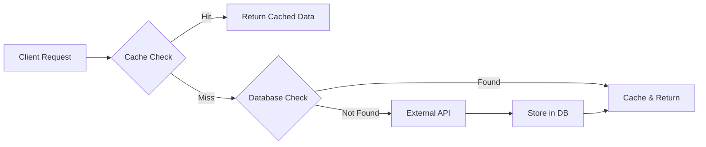

## Overview

TrackGeek provides comprehensive media tracking across **6 media types**, each powered by industry-leading external APIs. The system automatically fetches, caches, and refreshes media data to ensure accurate and up-to-date information.

## Supported Media Types

TrackGeek supports tracking across six distinct media categories:

<CardGroup cols={2}>
  <Card title="Anime" icon="tv">
    Japanese animation series and movies
  </Card>
  <Card title="Manga" icon="book">
    Japanese comics and graphic novels
  </Card>
  <Card title="TV Shows" icon="tv-retro">
    Television series and episodes
  </Card>
  <Card title="Movies" icon="film">
    Feature films and cinema releases
  </Card>
  <Card title="Games" icon="gamepad">
    Video games across all platforms
  </Card>
  <Card title="Books" icon="book-open">
    Books and literary works
  </Card>
</CardGroup>

## Data Source Integration

Each media type is powered by a specialized external API that provides comprehensive metadata, imagery, and relationships.

### Anime & Manga: Jikan API

**API Base URL**: `https://api.jikan.moe/v4`

<Accordion title="Anime Data Points">
  The Jikan service fetches comprehensive anime data including:
  
  - **Basic Info**: Title, type, source, episodes, status, rating
  - **Temporal Data**: Aired dates, duration, season, year, broadcast schedule
  - **Metadata**: Synopsis, background, rank, popularity
  - **Media**: Trailer videos, promotional videos, music videos, episode previews
  - **Production**: Producers, licensors, studios
  - **Classification**: Genres, explicit genres, themes, demographics
  - **Characters**: Character profiles with voice actors and roles
  - **Staff**: Production staff with positions
  - **Relationships**: Related anime/manga entries
  - **External Links**: Official and fan sites

  **Source**: `src/shared/infra/integrations/jikan.service.ts:111-266`
</Accordion>

<Accordion title="Manga Data Points">
  The Jikan service fetches comprehensive manga data including:
  
  - **Basic Info**: Title, type, chapters, volumes, status, publishing state
  - **Temporal Data**: Published dates, rank, popularity
  - **Metadata**: Synopsis
  - **Credits**: Authors and serializations
  - **Classification**: Genres, explicit genres, themes, demographics
  - **Characters**: Character profiles with roles
  - **Relationships**: Related manga/anime entries
  - **External Links**: Official and fan sites

  **Source**: `src/shared/infra/integrations/jikan.service.ts:268-349`
</Accordion>

### TV Shows & Movies: TMDB API

**API Base URL**: `https://api.themoviedb.org/3`

<Accordion title="Movie Data Points">
  The TMDB service fetches comprehensive movie data including:
  
  - **Identification**: TMDB ID, IMDB ID
  - **Basic Info**: Title, original title, original language, tagline
  - **Media**: Poster, backdrop, videos (trailers, teasers, behind-the-scenes)
  - **Financial**: Budget, revenue
  - **Release**: Release date, status
  - **Production**: Production companies, production countries, spoken languages
  - **Collection**: Belongs to collection (for franchises)
  - **Credits**: Full cast and crew with roles and profile images
  - **Metadata**: Overview, popularity, runtime, genres, homepage

  **Source**: `src/shared/infra/integrations/tmdb.service.ts:116-226`
</Accordion>

<Accordion title="TV Show Data Points">
  The TMDB service fetches comprehensive TV show data including:
  
  - **Identification**: TMDB ID
  - **Basic Info**: Name, original name, original language, tagline, type
  - **Media**: Poster, backdrop
  - **Production**: Created by, production companies, production countries, networks
  - **Status**: In production, status, languages
  - **Episodes**: Number of episodes, episode runtime
  - **Seasons**: Full season and episode breakdown with:
    - Season number, name, air date, poster
    - Individual episodes with names, overviews, air dates, still images
  - **Air Dates**: First air date, last air date, last episode to air, next episode to air
  - **Credits**: Full cast and crew with roles and profile images
  - **Metadata**: Popularity, homepage, origin country, genres

  **Source**: `src/shared/infra/integrations/tmdb.service.ts:228-377`
</Accordion>

### Games: IGDB API

**API Base URL**: `https://api.igdb.com/v4`

<Note>
  IGDB uses Twitch OAuth2 for authentication. Access tokens are cached and automatically refreshed before expiration.
</Note>

<Accordion title="Game Data Points">
  The IGDB service fetches extensive game data including:
  
  - **Basic Info**: Name, slug, summary, storyline
  - **Release**: First release date, release dates by platform
  - **Media**: Cover art, screenshots, artworks, videos
  - **Classification**: Genres, themes, keywords, player perspectives, game modes
  - **Ratings**: Age ratings with organizations and synopses
  - **Companies**: Involved companies (developers, publishers, porters, supporting)
  - **Platforms**: Supported platforms
  - **Multiplayer**: Detailed multiplayer modes (co-op, LAN, split-screen, online)
  - **Localization**: Game localizations and language support
  - **Relationships**: 
    - Similar games
    - Parent game, forks, ports
    - Expansions, DLCs, standalone expansions
    - Remakes, remasters
    - Bundles
  - **Collections**: Game collections and franchises
  - **Technical**: Game engines, game status, game type
  - **Alternative Names**: Alternative titles and comments
  - **External Games**: Cross-references to other platforms

  **Source**: `src/shared/infra/integrations/igdb.service.ts:138-557`
</Accordion>

### Books: Hardcover API

**API Base URL**: `https://api.hardcover.app/v1/graphql`

<Accordion title="Book Data Points">
  The Hardcover service fetches comprehensive book data using GraphQL:
  
  - **Basic Info**: Title, subtitle, alternative titles, slug, state
  - **Content**: Description, headline, pages, audio seconds
  - **Release**: Release date, release year
  - **Classification**: Book category ID, literary type ID, compilation status
  - **Editions**: 
    - Default audio edition
    - Default cover edition
    - Default ebook edition
    - Default physical edition
    - Up to 30 edition variants
  - **Media**: Cover images for all editions
  - **Series**: Featured book series information
  - **Links**: External links to retailers and reviews
  - **Canonical**: Canonical book reference
  - **Metadata**: Curation status, editions count

  **Source**: `src/shared/infra/integrations/hardcover.service.ts:83-263`
</Accordion>

## Database Schema

Each media type has a dedicated database model that stores the fetched data locally.

<Tabs>
  <Tab title="Anime">
    ```prisma
    model Anime {
      id               String   @id @default(uuid())
      malId            Int      @unique
      url              String
      imageUrl         String?
      trailer          Json?
      title            String
      titles           Json?
      type             String?
      source           String?
      numberOfEpisodes Int?
      status           String?
      aired            Json?
      duration         String?
      rating           String?
      rank             Int?
      popularity       Int?
      synopsis         String?
      background       String?
      season           String?
      year             Int?
      broadcast        Json?
      producers        Json?
      licensors        Json?
      studios          Json?
      genres           Json?
      explicitGenres   Json?
      themes            Json?
      demographics     Json?
      relations         Json?
      theme            Json?
      external          Json?
      characters        Json?
      cast             Json?
      videos            Json?
      lastRefreshedAt  DateTime @default(now())
      createdAt        DateTime @default(now())
      updatedAt        DateTime @updatedAt

      animeWatches    AnimeWatch[]
      animeProgresses AnimeProgress[]
      animeReviews    AnimeReview[]
      favorites       Favorite[]
      listItems       ListItem[]
      comments        Comment[]
    }
    ```
    
    **Source**: `prisma/schema.prisma:356-401`
  </Tab>
  
  <Tab title="Manga">
    ```prisma
    model Manga {
      id               String   @id @default(uuid())
      malId            Int      @unique
      url              String
      imageUrl         String?
      title            String
      titles           Json?
      type             String?
      numberOfChapters Int?
      numberOfVolumes  Int?
      status           String?
      publishing       Boolean?
      published        Json?
      rank             Int?
      popularity       Int?
      synopsis         String?
      authors          Json?
      serializations   Json?
      genres           Json?
      explicitGenres   Json?
      themes           Json?
      demographics     Json?
      relations        Json?
      external         Json?
      characters       Json?
      lastRefreshedAt  DateTime @default(now())
      createdAt        DateTime @default(now())
      updatedAt        DateTime @updatedAt

      mangaReads      MangaRead[]
      mangaProgresses MangaProgress[]
      mangaReviews    MangaReview[]
      favorites       Favorite[]
      listItems       ListItem[]
      comments        Comment[]
    }
    ```
    
    **Source**: `prisma/schema.prisma:403-438`
  </Tab>
  
  <Tab title="TV Show">
    ```prisma
    model TvShow {
      id                  String    @id @default(uuid())
      tmdbId              Int       @unique
      createdBy           Json?
      episodeRuntime      Int[]
      firstAirDate        DateTime?
      genres              Json?
      homepage            String?
      inProduction        Boolean?
      languages           String[]
      backdropUrl         String?
      lastAirDate         DateTime?
      lastEpisodeToAir    Json?
      name                String?
      nextEpisodeToAir    String?
      networks            Json?
      numberOfEpisodes    Int?
      numberOfSeasons     Int?
      originCountry       String[]
      originalLanguage    String?
      originalName        String?
      popularity          Int?
      posterUrl           String?
      productionCompanies Json?
      productionCountries Json?
      seasons             Json?
      status              String?
      tagline             String?
      type                String?
      cast                Json?
      crew                Json?
      lastRefreshedAt     DateTime  @default(now())
      createdAt           DateTime @default(now())
      updatedAt           DateTime @updatedAt

      tvshowWatches    TvShowWatch[]
      tvshowProgresses TvShowProgress[]
      tvshowReviews    TvShowReview[]
      favorites        Favorite[]
      listItems        ListItem[]
      comments         Comment[]
    }
    ```
    
    **Source**: `prisma/schema.prisma:440-483`
  </Tab>
  
  <Tab title="Movie">
    ```prisma
    model Movie {
      id                  String    @id @default(uuid())
      tmdbId              Int       @unique
      imdbId              String?
      belongsToCollection Json?
      budget              Int?
      genres              Json?
      backdropUrl         String?
      homepage            String?
      originalLanguage    String?
      originalTitle       String?
      overview            String?
      popularity          Int?
      posterPath          String?
      productionCompanies Json?
      productionCountries Json?
      releaseDate         DateTime?
      revenue             Int?
      runtime             Int?
      spokenLanguages     Json?
      status              String?
      title               String?
      videos               Json?
      cast                Json?
      crew                Json?
      posterUrl           String?
      lastRefreshedAt     DateTime  @default(now())
      createdAt           DateTime @default(now())
      updatedAt           DateTime @updatedAt

      movieWatches    MovieWatch[]
      movieProgresses MovieProgress[]
      movieReviews    MovieReview[]
      favorites       Favorite[]
      listItems       ListItem[]
      comments        Comment[]
    }
    ```
    
    **Source**: `prisma/schema.prisma:485-521`
  </Tab>
  
  <Tab title="Game">
    ```prisma
    model Game {
      id                    String    @id @default(uuid())
      igdbId                Int       @unique
      ageRatings            Json?
      aggregatedRating      Float?
      aggregatedRatingCount Int?
      alternativeNames      Json?
      artworks              Json?
      checksum              String?
      bundles               Json?
      collections           Json?
      coverUrl              String?
      dlcs                  Json?
      expandedGames         Json?
      expansions            Json?
      externalGames         Json?
      firstReleaseDate      DateTime?
      forks                 Json?
      franchise             Json?
      franchises            Json?
      gameEngines           Json?
      gameLocalizations     Json?
      gameModes             Json?
      gameStatus            Json?
      gameType              Json?
      genres                Json?
      hypes                 Int?
      involvedCompanies     Json?
      keywords              Json?
      multiplayerModes      Json?
      name                  String?
      parentGame            Json?
      platforms             Json?
      playerPerspectives    Json?
      ports                 Json?
      rating                Float?
      ratingCount           Int?
      releaseDates          Json?
      remakes               Json?
      remasters             Json?
      screenshots           Json?
      similarGames          Json?
      slug                  String    @unique
      standaloneExpansions  Json?
      storyline             Json?
      summary               String?
      totalRating           Float?
      totalRatingCount      Int?
      versionParent         Json?
      versionTitle          Json?
      videos                Json?
      lastRefreshedAt       DateTime  @default(now())
      createdAt             DateTime  @default(now())
      updatedAt             DateTime  @updatedAt

      gameProgresses GameProgress[]
      gameReviews    GameReview[]
      favorites      Favorite[]
      listItems      ListItem[]
      comments       Comment[]
    }
    ```
    
    **Source**: `prisma/schema.prisma:253-313`
  </Tab>
  
  <Tab title="Book">
    ```prisma
    model Book {
      id                     String    @id @default(uuid())
      hardcoverId            Int       @unique
      title                  String
      alternativeTitles      Json?
      audioSeconds           Int?
      bookCategoryId         Int?
      bookStatus             Json?
      canonical              Json?
      compilation            Boolean?
      curationStatus         Int?
      defaultAudioEdition    Json?
      defaultCoverEdition    Json?
      defaultEbookEdition    Json?
      defaultPhysicalEdition Json?
      description            String?
      editionsCount          Int?
      featuredBookSeries     Json?
      headline               String?
      imageUrl               Json?
      links                  Json?
      subtitle               String?
      literaryTypeId         Int?
      numberOfPages          Int?
      releaseDate            DateTime?
      releaseYear            Int?
      slug                   String
      state                  String?
      editions               Json?
      lastRefreshedAt        DateTime  @default(now())
      createdAt              DateTime  @default(now())
      updatedAt              DateTime  @updatedAt

      bookReads      BookRead[]
      bookProgresses BookProgress[]
      bookReviews    BookReview[]
      favorites      Favorite[]
      listItems      ListItem[]
      comments       Comment[]
    }
    ```
    
    **Source**: `prisma/schema.prisma:315-354`
  </Tab>
</Tabs>

## Data Flow Architecture

The media tracking system follows a consistent pattern across all media types:



### Search Flow

1. **Client Request**: User searches for media by query string
2. **Cache Check**: Check if search results are cached (24-hour TTL)
3. **External API Call**: If not cached, fetch from external API
4. **Cache Results**: Store results for 24 hours
5. **Return Data**: Send search results to client

**Example** (`src/modules/anime/anime.service.ts:30-32`):
```typescript
async searchAnimes(searchAnimeDto: SearchAnimeDto) {
  return this.integrationsService.jikan.searchAnimes(searchAnimeDto.query);
}
```

### Fetch Flow

1. **Client Request**: User requests specific media by ID
2. **Cache Check**: Check if media is cached (6-hour TTL)
3. **Database Check**: If not cached, check database
4. **External API Call**: If not in database, fetch from external API
5. **Store in Database**: Save fetched data with `lastRefreshedAt` timestamp
6. **Cache Data**: Cache for 6 hours
7. **Return Data**: Send media details to client

**Example** (`src/modules/anime/anime.service.ts:34-56`):
```typescript
async getAnimeById(id: number) {
  const cachedAnime = await this.cacheService.get<Anime>(
    this.cacheKeys.animeById.prefix(id)
  );

  if (cachedAnime) {
    return cachedAnime;
  }

  let anime = await this.databaseService.anime.findUnique({
    where: { malId: id },
  });

  if (!anime) {
    const jikanAnime = await this.integrationsService.jikan.getAnimeById(id);
    anime = await this.databaseService.anime.create({
      data: jikanAnime,
    });
  }

  await this.cacheService.set(
    this.cacheKeys.animeById.prefix(id),
    anime,
    this.cacheKeys.animeById.expiration
  );

  return anime;
}
```

## Refresh System

TrackGeek implements an intelligent refresh system to keep media data up-to-date without overwhelming external APIs.

### Refresh Interval

<Info>
  Media data can be refreshed once every **24 hours** per item.
</Info>

**Constant Definition** (`src/shared/constants/refresh-interval.ts:1`):
```typescript
export const REFRESH_INTERVAL_MS = 3600 * 24 * 1000; // 24 hours
```

### Refresh Flow

1. **Refresh Request**: User or system triggers refresh for specific media
2. **Existence Check**: Verify media exists in database
3. **Time Check**: Ensure 24 hours have passed since `lastRefreshedAt`
4. **Cache Invalidation**: Delete cached entry if exists
5. **External API Call**: Fetch latest data from external API
6. **Database Update**: Update media record with new data and timestamp
7. **Re-cache**: Cache fresh data for 6 hours

**Example** (`src/modules/anime/anime.service.ts:58-87`):
```typescript
async refreshAnime(refreshAnimeDto: RefreshAnimeDto) {
  const anime = await this.databaseService.anime.findUnique({
    where: { malId: refreshAnimeDto.id },
  });

  if (!anime) {
    throw new AppException(ERROR_CODES.ANIME_NOT_FOUND);
  }

  if (Date.now() - anime.lastRefreshedAt.getTime() < REFRESH_INTERVAL_MS) {
    throw new AppException(ERROR_CODES.ANIME_ALREADY_REFRESHED);
  }

  if (await this.cacheService.exists(this.cacheKeys.animeById.prefix(anime.malId))) {
    await this.cacheService.delete(this.cacheKeys.animeById.prefix(anime.malId));
  }

  const jikanAnime = await this.integrationsService.jikan.getAnimeById(anime.malId);

  await this.databaseService.anime.update({
    where: { malId: refreshAnimeDto.id },
    data: jikanAnime,
  });

  await this.cacheService.set(
    this.cacheKeys.animeById.prefix(anime.malId),
    anime,
    this.cacheKeys.animeById.expiration,
  );
}
```

### Error Handling

<Accordion title="Common Refresh Errors">
  - **`ANIME_NOT_FOUND`**: Media doesn't exist in database
  - **`ANIME_ALREADY_REFRESHED`**: Less than 24 hours since last refresh
  - **`JIKAN_SERVICE_UNAVAILABLE`**: External API is down or rate-limited
  - **`TMDB_SERVICE_UNAVAILABLE`**: TMDB API is unavailable
  - **`IGDB_SERVICE_UNAVAILABLE`**: IGDB API is unavailable
  - **`HARDCOVER_SERVICE_UNAVAILABLE`**: Hardcover API is unavailable
</Accordion>

## Caching Strategy

TrackGeek uses a multi-tier caching strategy for optimal performance:

| Cache Type | TTL | Use Case |
|-----------|-----|----------|
| Search Results | 24 hours | Search queries remain consistent |
| Media Details | 6 hours | Balance freshness with performance |
| External API Data | 24 hours | Reduce API calls to external services |

**Cache Key Pattern**:
- Anime: `anime:id:{malId}`
- Manga: `manga:id:{malId}`
- Movie: `movie:id:{tmdbId}`
- TV Show: `tvshow:id:{tmdbId}`
- Game: `game:id:{igdbId}`
- Book: `book:id:{hardcoverId}`

## Best Practices

<CardGroup cols={2}>
  <Card title="Cache First" icon="bolt">
    Always check cache before hitting the database or external APIs
  </Card>
  <Card title="Respect Rate Limits" icon="clock">
    Use the 24-hour refresh interval to avoid overwhelming external APIs
  </Card>
  <Card title="Handle Failures" icon="shield">
    Implement proper error handling for external API failures
  </Card>
  <Card title="Store Efficiently" icon="database">
    Use JSON fields for complex nested data from external APIs
  </Card>
</CardGroup>