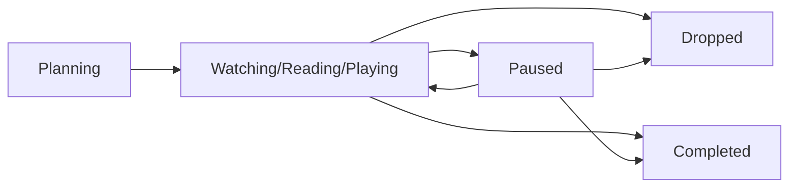

## Overview

The progress tracking system allows users to track their consumption status across all six media types. Each media type has specialized tracking models that capture viewing/reading/playing progress with appropriate granularity.

## Progress Models

TrackGeek uses two types of progress tracking:

1. **Watch/Read Models**: Legacy models for anime, manga, TV shows, movies, and books with episode/chapter tracking
2. **Progress Models**: Unified progress tracking for all six media types with standardized status tracking

### Progress Status Enum

All progress models use the `ProgressStatus` enum for consistency:

```prisma
enum ProgressStatus {
  Watching
  Playing
  Reading
  Completed
  Paused
  Dropped
  Planning
}
```

**Source**: `prisma/schema.prisma:633-641`

<Info>
  The status names are context-aware. "Watching" applies to anime/TV/movies, "Playing" to games, and "Reading" to books/manga.
</Info>

### Watch Status Enum

Legacy watch models use the `WatchStatus` enum:

```prisma
enum WatchStatus {
  Watching
  Completed
  Paused
  Dropped
  Planning
}
```

**Source**: `prisma/schema.prisma:523-529`

### Read Status Enum

Legacy read models use the `ReadStatus` enum:

```prisma
enum ReadStatus {
  Reading
  Completed
  Paused
  Dropped
  Planning
}
```

**Source**: `prisma/schema.prisma:587-593`

## Database Schema

<Tabs>
  <Tab title="Anime Progress">
    ### AnimeProgress Model
    
    Tracks anime watching progress with status tracking.
    
    ```prisma
    model AnimeProgress {
      id        String         @id @default(uuid())
      status    ProgressStatus
      userId    String
      animeId   String
      createdAt DateTime       @default(now())
      updatedAt DateTime       @updatedAt

      user  User  @relation(fields: [userId], references: [id])
      anime Anime @relation(fields: [animeId], references: [id])

      @@unique([userId, animeId])
      @@index([userId])
    }
    ```
    
    **Source**: `prisma/schema.prisma:643-656`
    
    ### AnimeWatch Model (Legacy)
    
    Legacy model with episode tracking:
    
    ```prisma
    model AnimeWatch {
      id          String      @id @default(uuid())
      season      Int
      episode     Int
      status      WatchStatus
      userId      String
      animeId     String
      startedAt   DateTime?
      completedAt DateTime?
      createdAt   DateTime    @default(now())
      updatedAt   DateTime    @updatedAt

      user  User  @relation(fields: [userId], references: [id])
      anime Anime @relation(fields: [animeId], references: [id])

      @@unique([userId, animeId])
      @@index([userId])
    }
    ```
    
    **Source**: `prisma/schema.prisma:531-548`
    
    <Note>
      Each user can only have one watch record per anime (enforced by unique constraint).
    </Note>
  </Tab>
  
  <Tab title="Manga Progress">
    ### MangaProgress Model
    
    Tracks manga reading progress with status tracking.
    
    ```prisma
    model MangaProgress {
      id        String         @id @default(uuid())
      status    ProgressStatus
      userId    String
      mangaId   String
      createdAt DateTime       @default(now())
      updatedAt DateTime       @updatedAt

      user  User  @relation(fields: [userId], references: [id])
      manga Manga @relation(fields: [mangaId], references: [id])

      @@unique([userId, mangaId])
      @@index([userId])
    }
    ```
    
    **Source**: `prisma/schema.prisma:658-671`
    
    ### MangaRead Model (Legacy)
    
    Legacy model with chapter and volume tracking:
    
    ```prisma
    model MangaRead {
      id          String     @id @default(uuid())
      status      ReadStatus
      chapter     Int?
      volume      Int?
      userId      String
      mangaId     String
      startedAt   DateTime?
      completedAt DateTime?
      createdAt   DateTime   @default(now())
      updatedAt   DateTime   @updatedAt

      user  User  @relation(fields: [userId], references: [id])
      manga Manga @relation(fields: [mangaId], references: [id])

      @@unique([userId, mangaId])
      @@index([userId])
    }
    ```
    
    **Source**: `prisma/schema.prisma:614-631`
  </Tab>
  
  <Tab title="TV Show Progress">
    ### TvShowProgress Model
    
    Tracks TV show watching progress with status tracking.
    
    ```prisma
    model TvShowProgress {
      id        String         @id @default(uuid())
      status    ProgressStatus
      userId    String
      tvShowId  String
      createdAt DateTime       @default(now())
      updatedAt DateTime       @updatedAt

      user   User   @relation(fields: [userId], references: [id])
      tvShow TvShow @relation(fields: [tvShowId], references: [id])

      @@unique([userId, tvShowId])
      @@index([userId])
      @@map("TVShowProgress")
    }
    ```
    
    **Source**: `prisma/schema.prisma:673-687`
    
    ### TvShowWatch Model (Legacy)
    
    Legacy model with season and episode tracking:
    
    ```prisma
    model TvShowWatch {
      id          String      @id @default(uuid())
      season      Int
      episode     Int
      status      WatchStatus
      userId      String
      tvShowId    String
      startedAt   DateTime?
      completedAt DateTime?
      createdAt   DateTime    @default(now())
      updatedAt   DateTime    @updatedAt

      user   User   @relation(fields: [userId], references: [id])
      tvShow TvShow @relation(fields: [tvShowId], references: [id])

      @@unique([userId, tvShowId])
      @@index([userId])
      @@map("TVShowWatch")
    }
    ```
    
    **Source**: `prisma/schema.prisma:550-568`
  </Tab>
  
  <Tab title="Movie Progress">
    ### MovieProgress Model
    
    Tracks movie watching progress with status tracking.
    
    ```prisma
    model MovieProgress {
      id        String         @id @default(uuid())
      status    ProgressStatus
      userId    String
      movieId   String
      createdAt DateTime       @default(now())
      updatedAt DateTime       @updatedAt

      user  User  @relation(fields: [userId], references: [id])
      movie Movie @relation(fields: [movieId], references: [id])

      @@unique([userId, movieId])
      @@index([userId])
    }
    ```
    
    **Source**: `prisma/schema.prisma:689-702`
    
    ### MovieWatch Model (Legacy)
    
    Legacy model for movie completion tracking:
    
    ```prisma
    model MovieWatch {
      id          String      @id @default(uuid())
      status      WatchStatus
      userId      String
      movieId     String
      startedAt   DateTime?
      completedAt DateTime?
      createdAt   DateTime    @default(now())
      updatedAt   DateTime    @updatedAt

      user  User  @relation(fields: [userId], references: [id])
      movie Movie @relation(fields: [movieId], references: [id])

      @@unique([userId, movieId])
      @@index([userId])
    }
    ```
    
    **Source**: `prisma/schema.prisma:570-585`
    
    <Note>
      Movies don't have episode tracking since they're single units of content.
    </Note>
  </Tab>
  
  <Tab title="Game Progress">
    ### GameProgress Model
    
    Tracks game playing progress with status tracking.
    
    ```prisma
    model GameProgress {
      id        String         @id @default(uuid())
      status    ProgressStatus
      userId    String
      gameId    String
      createdAt DateTime       @default(now())
      updatedAt DateTime       @updatedAt

      user User @relation(fields: [userId], references: [id])
      game Game @relation(fields: [gameId], references: [id])

      @@unique([userId, gameId])
      @@index([userId])
    }
    ```
    
    **Source**: `prisma/schema.prisma:704-717`
    
    <Info>
      Game progress uses the "Playing" status to indicate active gameplay.
    </Info>
  </Tab>
  
  <Tab title="Book Progress">
    ### BookProgress Model
    
    Tracks book reading progress with status tracking.
    
    ```prisma
    model BookProgress {
      id        String         @id @default(uuid())
      status    ProgressStatus
      userId    String
      bookId    String
      createdAt DateTime       @default(now())
      updatedAt DateTime       @updatedAt

      user User @relation(fields: [userId], references: [id])
      book Book @relation(fields: [bookId], references: [id])

      @@unique([userId, bookId])
      @@index([userId])
    }
    ```
    
    **Source**: `prisma/schema.prisma:719-732`
    
    ### BookRead Model (Legacy)
    
    Legacy model with chapter and volume tracking:
    
    ```prisma
    model BookRead {
      id          String     @id @default(uuid())
      status      ReadStatus
      chapter     Int?
      volume      Int?
      userId      String
      bookId      String
      startedAt   DateTime?
      completedAt DateTime?
      createdAt   DateTime   @default(now())
      updatedAt   DateTime   @updatedAt

      user User @relation(fields: [userId], references: [id])
      book Book @relation(fields: [bookId], references: [id])

      @@unique([userId, bookId])
      @@index([userId])
    }
    ```
    
    **Source**: `prisma/schema.prisma:595-612`
  </Tab>
</Tabs>

## Status Transitions

The progress system supports natural status transitions based on user behavior:



### Status Definitions

<Accordion title="Watching/Reading/Playing">
  User is actively consuming the media. This is the primary active state.
  
  - **Anime/TV/Movie**: Currently watching
  - **Manga/Book**: Currently reading
  - **Game**: Currently playing
</Accordion>

<Accordion title="Completed">
  User has finished the media in its entirety. This is a terminal state indicating full consumption.
  
  <Info>
    Completion automatically triggers feed events and can unlock achievements/medals.
  </Info>
</Accordion>

<Accordion title="Paused">
  User has temporarily stopped but intends to continue. Progress is preserved.
  
  Can transition back to active state or forward to Completed/Dropped.
</Accordion>

<Accordion title="Dropped">
  User has discontinued and doesn't intend to continue. Progress is preserved but consumption ceased.
  
  <Note>
    Dropped items can still be reviewed and are counted in user statistics.
  </Note>
</Accordion>

<Accordion title="Planning">
  User intends to start but hasn't begun yet. This is the initial state.
  
  Common for:
  - Upcoming releases
  - Backlog management
  - Wishlist tracking
</Accordion>

## Progress Features

### Unique Constraints

All progress models enforce a unique constraint on `[userId, mediaId]` to ensure:

- One progress record per user per media item
- No duplicate tracking entries
- Clean update patterns

**Example from AnimeProgress** (`prisma/schema.prisma:654`):
```prisma
@@unique([userId, animeId])
```

### Automatic Timestamps

Every progress record maintains:

- **`createdAt`**: When user first added the item
- **`updatedAt`**: Last time status or progress changed

### Legacy Models: Temporal Tracking

The legacy Watch/Read models track consumption timeframes:

- **`startedAt`**: When user began watching/reading (nullable)
- **`completedAt`**: When user finished (nullable)

### Legacy Models: Granular Progress

Watch/Read models track precise position:

<Tabs>
  <Tab title="Anime/TV Shows">
    - **`season`**: Current season number
    - **`episode`**: Current episode number
    
    Allows resuming at exact position in episodic content.
  </Tab>
  
  <Tab title="Manga/Books">
    - **`chapter`**: Current chapter number (nullable)
    - **`volume`**: Current volume number (nullable)
    
    Both fields are optional since not all manga/books use both.
  </Tab>
  
  <Tab title="Movies">
    No granular progress needed - movies are atomic units.
  </Tab>
</Tabs>

## Completion Tracking

Completion is tracked differently across models:

### Progress Models

Status-based completion:
```typescript
const isCompleted = progress.status === ProgressStatus.Completed;
```

### Watch/Read Models

Multiple indicators:
```typescript
const isCompleted = 
  watch.status === WatchStatus.Completed || 
  watch.completedAt !== null;
```

## Integration with Feed System

Progress updates can trigger feed events to notify followers:

| Event Type | Trigger |
|-----------|---------||
| `NewProgress` | User updates status to Watching/Reading/Playing |
| `NewWatch` | User marks anime/TV show as watching (legacy) |

**Feed Event Schema** (`prisma/schema.prisma:230-251`):
```prisma
enum FeedEventType {
  NewFollower
  NewFavorite
  NewList
  NewListItem
  NewReview
  NewWatch
  NewProgress
}

model FeedEvent {
  id        String        @id @default(uuid())
  type      FeedEventType
  userId    String
  metadata  Json?
  createdAt DateTime      @default(now())

  user      User       @relation(fields: [userId], references: [id], onDelete: Cascade)
  reactions Reaction[]

  @@index([userId, createdAt])
}
```

## User Statistics

Progress data powers user statistics and achievements:

<CardGroup cols={2}>
  <Card title="Completion Rate" icon="chart-line">
    Percentage of started items marked as completed
  </Card>
  <Card title="Total Watched" icon="eye">
    Count of anime/TV/movies with Completed status
  </Card>
  <Card title="Total Read" icon="book-open">
    Count of manga/books with Completed status
  </Card>
  <Card title="Total Played" icon="gamepad">
    Count of games with Completed status
  </Card>
  <Card title="Current Watching" icon="tv">
    Count of items with Watching status
  </Card>
  <Card title="Backlog Size" icon="list">
    Count of items with Planning status
  </Card>
</CardGroup>

## Indexing Strategy

All progress models are indexed on `userId` for efficient queries:

```prisma
@@index([userId])
```

This enables fast retrieval of:
- All progress for a user
- Status-filtered queries (e.g., "show me all watching")
- Aggregate statistics

## Best Practices

<CardGroup cols={2}>
  <Card title="Upsert Pattern" icon="arrows-rotate">
    Use upsert operations to handle create/update seamlessly due to unique constraints
  </Card>
  <Card title="Cascade Deletes" icon="trash">
    Progress records cascade delete when user or media is deleted
  </Card>
  <Card title="Status Validation" icon="check">
    Validate status transitions to prevent invalid states
  </Card>
  <Card title="Feed Events" icon="bullhorn">
    Consider which status changes should trigger feed events
  </Card>
</CardGroup>

## Migration from Legacy Models

If migrating from Watch/Read models to Progress models:

1. Map `WatchStatus`/`ReadStatus` to `ProgressStatus`
2. Preserve `createdAt` and `updatedAt` timestamps
3. Store granular progress (episode/chapter) in metadata if needed
4. Migrate temporal data (`startedAt`, `completedAt`) to metadata
5. Maintain unique constraints on `[userId, mediaId]`